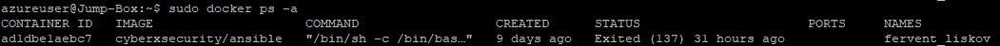

## Automated ELK Stack Deployment

The files in this repository were used to configure the network depicted below.

These files have been tested and used to generate a live ELK deployment on Azure. They can be used to either recreate the entire deployment pictured above. Alternatively, select portions of the playbook file may be used to install only certain pieces of it, such as Filebeat.

  - _TODO: Enter the playbook file._

This document contains the following details:
- Description of the Topologu
- Access Policies
- ELK Configuration
  - Beats in Use
  - Machines Being Monitored
- How to Use the Ansible Build

### Description of the Topology

The main purpose of this network is to expose a load-balanced and monitored instance of DVWA, the D*mn Vulnerable Web Application.

Load balancing ensures that the application will be highly available, in addition to restricting unauthorized access to the network.
-What aspect of security do load balancers protect? What is the advantage of a jump box?
Load balancers act as a point of entry for traffic and provides a layer of protection that guards the internal webservers.  Using a load balancer along with a jump box can force traffic to be routed in a specific way.  The advantage of a jump box is that all SSH requests must first be made to the jumpbox in order to access the webservers.  The difference between the load balancer and the jump box is that the load balancer acts more like a public facing entry point for HTTP traffic, while the jump box is also public facing however it responds to SSH only and is intended to be used only by system administration. 

Integrating an ELK server allows users to easily monitor the vulnerable VMs for changes to the filesystem and system network.
- Filebeat watches specific system logs that record access attempts, logins, file movement and more
- Metricbeat records data related to system performance such as CPU, memory and load

The configuration details of each machine may be found below.
_Note: Use the [Markdown Table Generator](http://www.tablesgenerator.com/markdown_tables) to add/remove values from the table_.

| Name     | Function | IP Address    | Operating System |
|----------|----------|---------------|------------------|
| Jump Box | Gateway  | 10.0.0.4      | Linux            |
| Web1     | webserver| 10.0.0.5      | Linux            |                  
| Web2     | webserver| 10.0.0.6      | Linux            |
| ELK      | Kibana   | 10.1.0.4      | Linux            |

### Access Policies

The machines on the internal network are not exposed to the public Internet. 

Only the Jump Box machine can accept connections from the Internet. Access to this machine is only allowed from the following IP addresses:
- 76.96.161.202 (Admin's public IP)

Machines within the network can only be accessed by Jump Box IP:.
- 10.0.0.4

A summary of the access policies in place can be found in the table below.

| Name     | Publicly Accessible | Allowed IP Addresses |
|----------|---------------------|----------------------|
| Jump Box | Yes                 | 76.96.161.202 (Admin)|
| Web1     | No                  | 10.0.0.4 (Jumpbox)   |
| Web2     | No                  | 10.0.0.4 (Jumpbox)   |

### Elk Configuration

Ansible was used to automate configuration of the ELK machine. No configuration was performed manually, which is advantageous because...
- of scalability 

The playbook implements the following tasks:
- The ELK Playbook consists of serveral steps: 
Increase virtual memory
Install docker.io
Install python3-pip
Install python module docker
download and launch elk container
enable docker on boot

- Filebeat install
download filebeat from the internet
copy config files to correct locations
enable filebeat modules
setup filebeat
start filebeat
enable filebeat on boot

- metricbeat install
download metricbeat from the internet
copy config files to correct locations
enable metricbeat modules
setup metricbeat
start metricbeat
enable metricbeat on boot

The following screenshot displays the result of running `docker ps` after successfully configuring the ELK instance.

### Target Machines & Beats
This ELK server is configured to monitor the following machines:
- Web1 - 10.0.0.5
- Web2 - 10.0.0.6

We have installed the following Beats on these machines:
- Metricbeat, filebeat

These Beats allow us to collect the following information from each machine:
- Metricbeat - collecs information about CPU, memory system performance including instances of containers such as when the computer is under high stress
- Filebeat - collects system logs and documents events in a centralized location.  virtually any .log file can be logged with filebeat such as login attempts or authorized access

### Using the Playbook
In order to use the playbook, you will need to have an Ansible control node already configured. Assuming you have such a control node provisioned: 

SSH into the control node and follow the steps below:
- Copy the playbook file to /etc/ansible/ of your provisioner machine.
- Update the host file to include the host IP of your target machines
- Run the playbook, and navigate to target machines to check that the installation worked as expected.

_TODO: Answer the following questions to fill in the blanks:
- _Which file is the playbook? -the .yml file.  Where do you copy it? -to the provisioner machine preferably /etc/ansible/playbook.yml
- _Which file do you update to make Ansible run the playbook on a specific machine? -the host file, specify the group of machines to run the playbook on 
- How do I specify which machine to install the ELK server on versus which to install Filebeat on? -specify the correct hosts:"group name" in the playbook prior to running it 
- _Which URL do you navigate to in order to check that the ELK server is running? navigate to the public IP of the ELK server http://20.102.68.145:5601/app/kibana

_As a **Bonus**, provide the specific commands the user will need to run to download the playbook, update the files, etc._